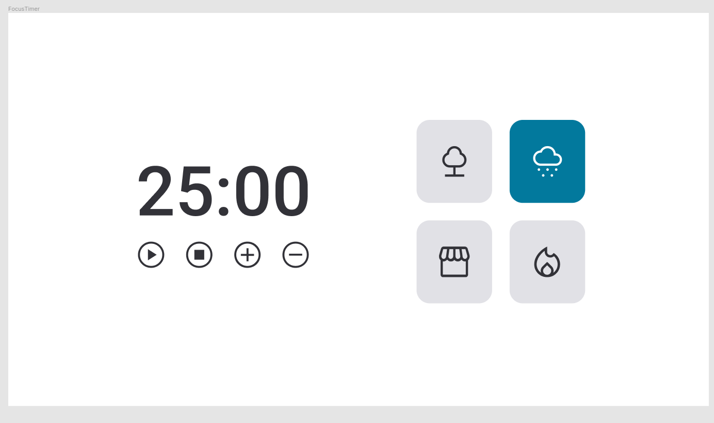

# Focus timer 2.0  🚀

Focus Timer 2.0 🚀
Descrição
O Focus Timer 2.0 é uma aplicação minimalista desenvolvida com as tecnologias mais modernas:

⚙️ JavaScript: Responsável pela lógica de temporização e interatividade.

🌐 HTML: Estrutura base da aplicação.

🎨 CSS: Estilo elegante para uma experiência agradável.

Funcionalidades Principais
Temporizador Pomodoro 🍅
Configure e gerencie seus períodos de trabalho e descanso para otimizar sua concentração.

Controles do Temporizador 🎮
▶️ Play / ⏹️Pause: Inicie ou pause o temporizador para controlar seu tempo de trabalho.

➕ Acrescentar 5 minutos: Adicione mais tempo ao seu período de trabalho com um clique.

➖ Decrementar 5 minutos: Reduza o tempo de trabalho se necessário.

Como Usar
Clone o repositório.
Abra o arquivo index.html em seu navegador favorito.
Contribuições
Contribuições são bem-vindas! Sinta-se à vontade para abrir issues, propor melhorias ou enviar pull requests.

Licença
Este projeto é licenciado sob a Licença MIT.

Esperamos que o Focus Timer 2.0 seja uma ferramenta útil para melhorar sua produtividade! 👩‍💻🚀

